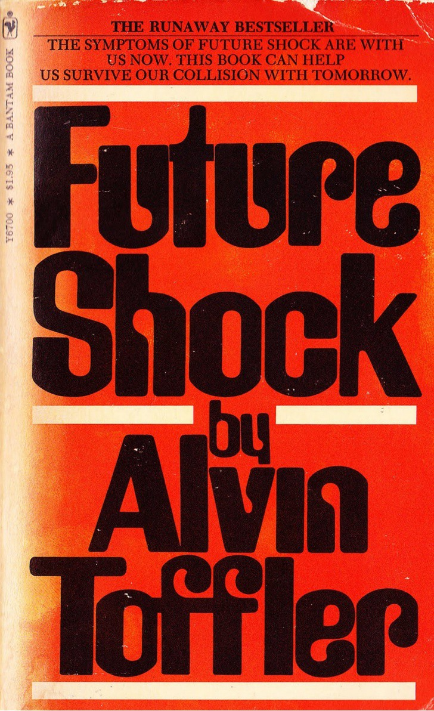

Future shock happens when we are bombarded with more information than we can process, when too much is changing too fast, and we feel overwhelmed by a feeling of malaise and confusion. But Future Shock is also an opportunity to recognize that we are quickly innovating solutions to previously unsolvable problems — problems that will allow us to build the world we want.

This project has started as 4 years ago as a Facebook group.

The name pays homage to the visionary book Future Shock published in 1970. It was written by a futurist Alvin Toffler.

The site has quite a neat technical setup in the background. I've actually liked it so much that I've decided to keep the repository public and write short documentation so others can create similar small-scale syndication operations.

TECHNICAL DOCUMENTATION ON GITHUB
